# Kubernetes-mastery
A repository to learn and implement each and every concept of kubernetes with aws

# 1. Understanding kubernetes from containers to orchestration

# 2. Kubernetes key components and their functions

# 3. Schedulers, workloads and scaling

# 4. Exploring kubernetes basics

# 5. principles of scaling: Horizontal vs Vertical

# 6. Autoscaling in Action

# 7. Networking, Services and Security

# 8. Essentials of kubernetes networking

# 9. Kubernetes Network Architecture: Services and ingresses

# 10. Storage: Persitence and CSI Drivers

# 11. Security best practices in Kubernetes and RBAC

# 12. Deployment, Application management, Gitops

# 13. Real-world deploymnet scenarios and Continous Deployment

# 14. Understanding Gitops: Principles and practices

# 15. Reliability, Monitoring, and Maintainance

# 16. Custom Resource Definitions and Operators

# 17. Ensuring High Availability and Reliability

# 18. Monitoring Best practices

# 19. Backup, maintainance, and Disaster Recovery in kubernetes

# 20. Troubleshooting and Best practices

# 21. Real-world troubleshooting Scenarios

# 22. Common mistakes and how to avoid them 

# 23. Interview stories from authors


## 1. Understanding kubernetes from containers to orchestration

<details> <summary>1. can you elaborate on the specific architectural differences that lead to this efficiency (containers vs Vms) </summary>The core difference lies in their level of abstraction. A VM abstracts the hardware layer. It uses a hypervisor to create virtual hardware, upon which a full, independent guest operating system (OS) runs. This means every VM carries the overhead of a complete OS kernel, its libraries, and binaries, making them large and slow to boot. Containers, on the other hand, abstract the operating system layer. They run on a shared host OS kernel and package just the application code with its specific libraries and dependencies. They don’t need to boot an entire OS. This sharing of the host kernel is what makes them so lightweight, resource-efficient, and fast to create and deploy—often in seconds. </details>

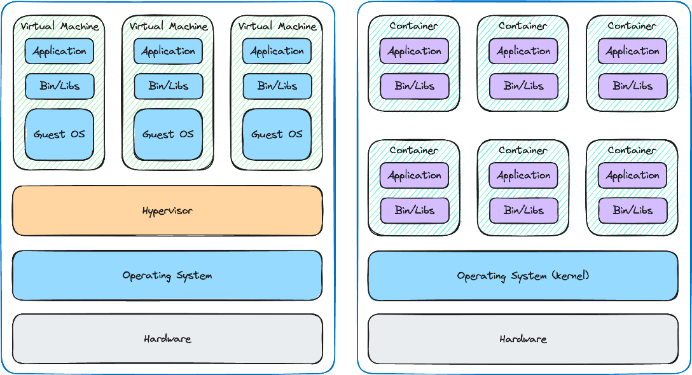
vms vs containers


Containerization workflow


<details><summary>2. Describe 3 linux kernel features that make containers possible </summary>Namespaces (pid,net,mnt,ipc,uts & user), cgroups for resource limits and union filesystems(overlayfs) enabling copy-on-write images</details>
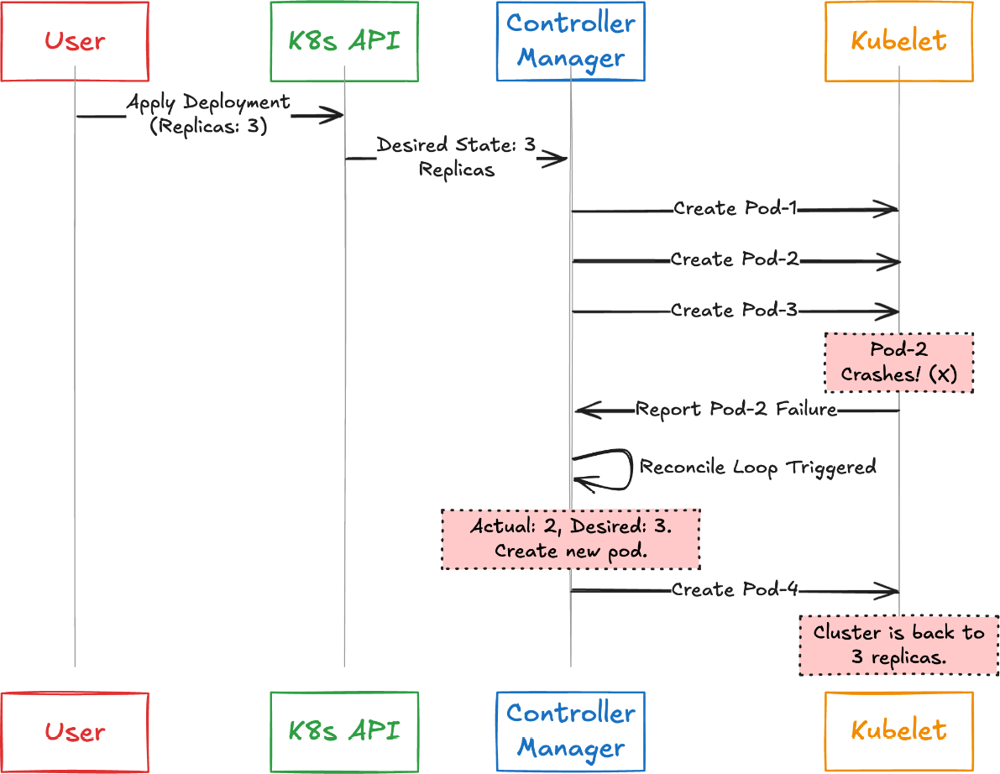
kubernetes self-healing in action

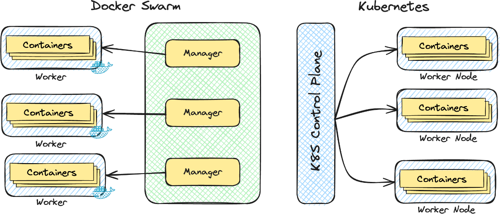
Dockerswarm vs kubernetes

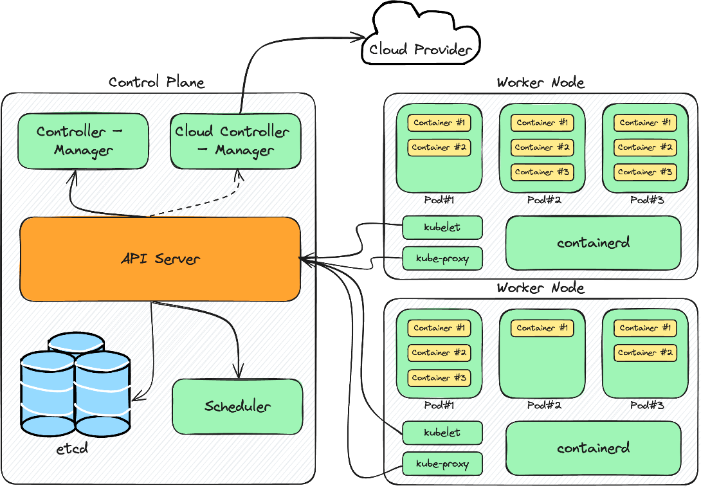
kubernetes architecuture

<details><summary>3. Why did Kubernetes deprecate Docker Engine as a runtime, and what replaced it? </summary> </details>


## 2. Kubernetes key components and their functions
<details><summary>4. what are the four core components of the kubernetes Control plane ? </summary> The control plane is composed of 4 core components: The API server, etcd, Scheduler, and the Controller Manager. The API Server acts as the cluster’s gateway , etcd is the distributed key-value store that acts as the single source of truth, the Scheduler assigns work to nodes, and the Controller Manager runs the processes that manage the system’s state. </details>

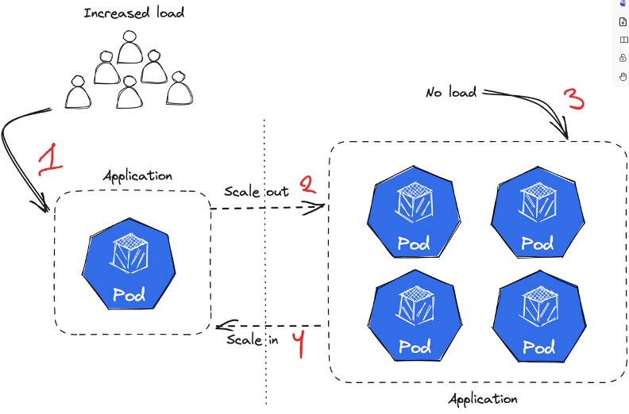

pod creation flow diagram


<details><summary>5. What is etcd’s role, and what happens if the etcd cluster loses quorum? </summary>etcd’s role is to serve as a strongly consistent, distributed key-value store that holds all of a Kubernetes cluster’s configuration and state data. It is the cluster’s single source of truth, using a consensus algorithm like Raft to ensure data consistency across all nodes. The control plane is effectively paralyzed, requiring manual intervention to fix.  </details>
<details><summary>6. How does scheduler decide where to place a pod ? </summary>The scheduler's primary task is to select an appropriate node for a pod to run on. It makes this decesion by evaluating several factors, including the Pod's resource requirements (CPU and Memory), resource availability on the nodes, quality of service classes (QOS) In scenarios of resource contention (e.g., memory pressure on a node), the kubelet evicts Pods based on their QoS class, starting with BestEffort, then Burstable, and finally, Guaranteed Pods. This ensures that the most critical workloads are protected. </details>
<details><summary>7. what is reconcilliation loop and which component is responsible for it ? </summary>A reconciliation loop is the principle where a controller continuously watches a specific resource, compares its actual state to the desired state stored in etcd, and takes action to reconcile any differences. The Controller Manager is the component that runs these loops, driving Kubernetes’ self-healing and declarative nature. </details>

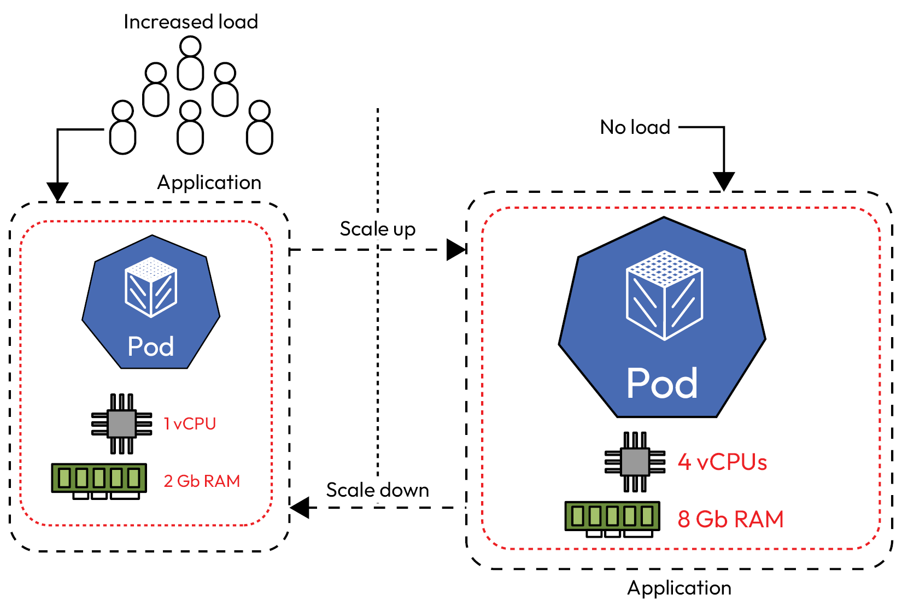
kubernetes worker node at a high level


<details><summary>8. what are the three key components that run on every kubernetes worker node ?</summary>Every worker node runs three key components: the kubelet, which ensures containers are running in Pods; the container runtime (like Docker or containerd), which is responsible for pulling images and running the containers; and the kube-proxy, which handles network routing and load balancing for services. </details>
<details><summary> 9. what is the kubelet and why is it so important ? </summary> The kubelet is the critical agent that runs on each worker node and is responsible for managing the containers on that node as specified by the API server. It’s important because it acts as the bridge between the control plane and the worker node, taking instructions from the API server and translating them into actions for the container runtime, as well as reporting the health and status of Pods back to the control plane.</details>
<details><summary>10. How does kube-proxy enable service networking ? </summary>kube-proxy runs on each node to facilitate network communication for services. When a service is created, kube-proxy maintains network rules on the node (typically using iptables) to route traffic destined for a service's stable IP address to the correct backing pods. It watches the API server for changes to Services and Endpoints to keep these rules up to date </details>
<details><summary> 11. what is the difference between container runtime and the CRI (Container Runtime Interface) </summary>The container runtime (like containerd) is the software that is responsible for the core task of running and managing containers. The container runtime interface(CRI) is a kubernetes project that acts as a standardized API Bridge, defining the communication interface between the kubelet and the container runtime. CRI allows kubernetes to be pluggable, supporting various runtimes without changing its core code </details>

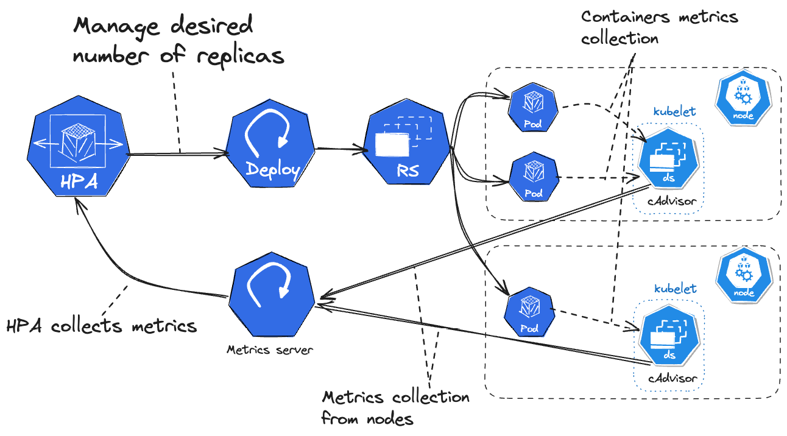
Dockershim versus CRI

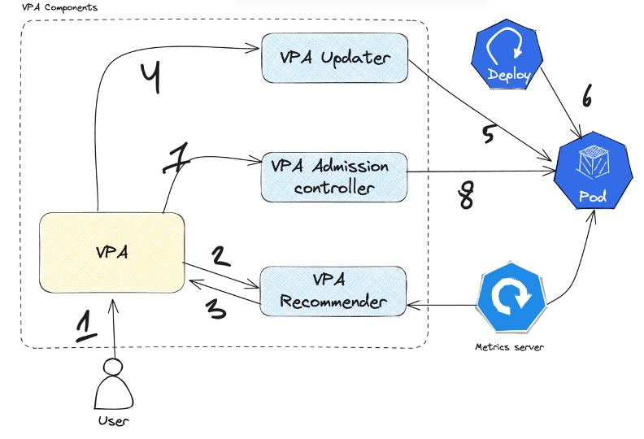
The shift from Dockershim to the Container Runtime Interface(CRI)

<details><summary>12. What is a static pod and when is it used ?</summary>A static pod is a pod that is managed directly by the kubelet on a node, without being controlled by API Server. They are defined by configuration files in a local directory on the node (like /etc/kubernetes/manifests). Static pods are typically used for boostrapping essential system components on a node, such as kube-proxy, CNI Plugins, or even the control plane components themselves</details>

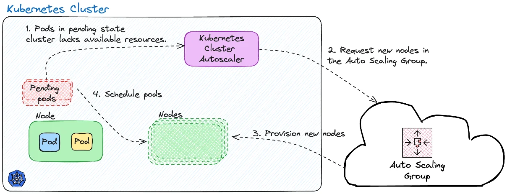
kube-dns in action


<details><summary>13. How does DNS Enable service discovery in kubernetes ?</summary>the cluster DNS service, typicaly provided by CoreDNS, enables a reliable discovery mechanism for services to find each other. Applications can use stable DNS names to communicate with other services, abstracting away the underlying, ephermal IP addresses of pods. When a service is created, DNS records are automatically set up to distribute traffic to the appropriate backing pods</details>
<details><summary>14. What is the role of Container Network Interface (CNI) ?</summary> The role of CNI is to provide a standard, plug-in system for networking in kubernetes. Kubernetes delegates all network setup--such as assigning IP addresses to pods and configuring routes--to a CNI plugin like calico or Flannel. This modular design makes kubernetes incredibly flexible, allowing users to choose a networking solution that fits their needs. </details>

<details><summary>15. what are the main trade-offs between a self-hosted and a managed kubernetes service </summary>The choice between a self-hosted and managed kubernetes cluster is a trade-off between control and convenience. A self-hosted deployment provides maximum control over the cluster's configuration and infrastructure but requires significant effort and expertise to manage. A managed service simplifies operations and reduces operational overhead by having a cloud provider manage the control plane but offers less customization. </details>

## 3. Schedulers, workloads and scaling


## 4. Exploring kubernetes basics

<details><summary>16. Why do containers within a pod share storage and network resources ? </summary> Sharing storage and networking makes inter-container communication faster and more efficient, allowing tightly coupled processes to collaborate seamlessly within the same pod environment. </details>
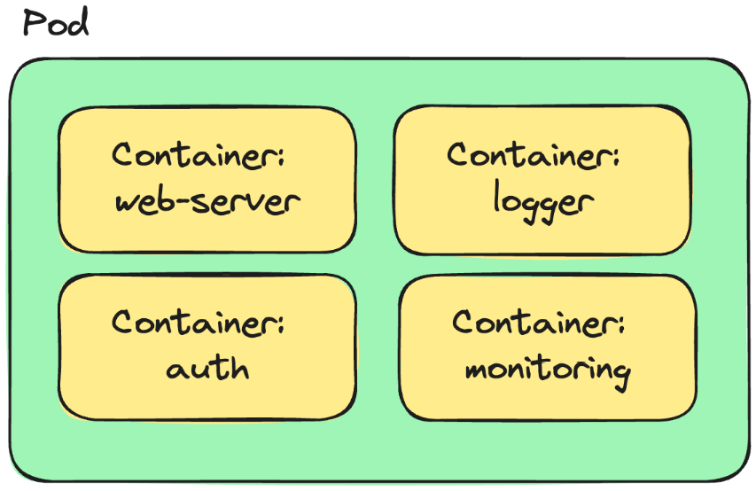
multi-container kubernetes pod layout

<details><summary> 17. What is the purpose of `emptyDir` in a Pod volume definition ?</summary>The `emptyDir` volume type creates a temporary shared directory accessible by all containers in a pod, which exists only for the life of the pod and is useful for transient data sharing </details>

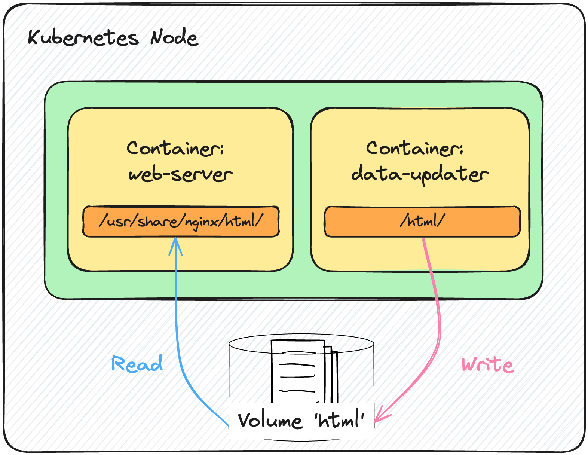
Data sharing between containers using a shared volume within a pod

<details><summary>18. what is the main difference between an init container and a regular container in a pod? </summary> Init containers run once and must complete successfully before regular container starts. They're ideal for setup tasks, such as preparing environments or checking dependencies. Unlike regular containers, init containers do not support probes such as `liveness probe, readinessprobe or startup probe` because these are designed for containers that continue running, not those exit upon completion of their tasks. if init container fails, the k8s cluster will restart until it succeeds, unless the pod's restart policy is set to `Never`</details>
<details><summary> 19. When should you use a sidecar container in your pod design ?</summary>Sidecars are great when you want to add modular support service to your main application -- such as logging, monitoring, or proxying-without modifying the core application logic. Side cars can also use probes to manage their lifecycle unlike init containers.They continue to run as long as the pod is running,providing ongoing support service to the main application </details>
<details><summary> 20. Why is understanding the pod lifecycle important for kubernetes troubleshooting ?</summary>Knowing the lifecycle phases helps you diagnose and fix issues such as pending pods, failed containers, or unreachable nodes more effectively during cluster operations </details>

<details><summary>21. what does the `crashloopbackoff` status indicate in a kubernetes pod ? </summary>It means the container inside the pod repeatedly crashes shortly after starting. Kubernetes backs off from restarting it and logs the errors to help with debugging and for debugging we can use commands such as `kubectl describe deployment`, `kubectl describe pod`, `kubectl logs` and `kubectl get events` </details>
<details><summary> 22. why are container probes critical for pod health management in kubernetes ?</summary>Probes allow kubernetes to detect whether a container is healthy, ready to serve traffic, or still starting up. This helps automate recovery and reduce downtime </details>
<details><summary> 23. what's the difference between a liveness probe and a readiness probe ?</summary>A liveness probe checks whether the container is running, and restarts it if it's not. A readiness probe checks whether a container is ready to serve traffic and removes it from service if it's not </details>
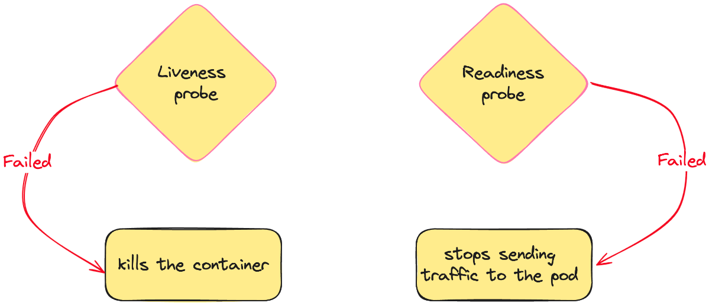
<details><summary> 24. when should you use a startup probe in a container ?</summary>Use startup probes for applications that take a long time to start. It prevents kubernetes from killing the container during its slow boot by temporarily disabling other probes </details>
<details><summary>25. what is the primary function of a replicaset in kubernetes ? </summary>A Replicaset ensures a specified number of Identical pods are always running. It automatically replaces failed or deleted pods to maintain the desired replica count. </details>
<details><summary>26. you rarely create pods directly for production applications. why ?</summary>Because a raw pod has no self-healing or scaling capabilities. If node goes down, the pod is gone forever. instead, you declare the desired state for your application using a higher-level controller. The most common controller for stateless apps is the Deployment, which automates updates, scaling, and rollbacks by manging pods for you</details>
<details><summary>27. what's the difference between a Deployment and a ReplicaSet ?</summary>A Replicaset's only job is to ensure a specific number of identical pods are running at all times. A deployment is higher-level controller that manages Replicasets. You use a Deployment to handle updates, rollbacks, and scaling, and the Deployment, in turn, creates and manages the underlying Replicasets to achieve the desired state. You almost always interact with Deployments, not Replicasets directly </details>
<details><summary> 28. what are `maxsurge` and `maxUnavailable` in a rolling update strategy ? </summary>The `maxsurge` parameter defines how many extra pods can be added during an update, while `maxunavailable` sets how many can be unavailable. These values can help control update speed and stability </details>
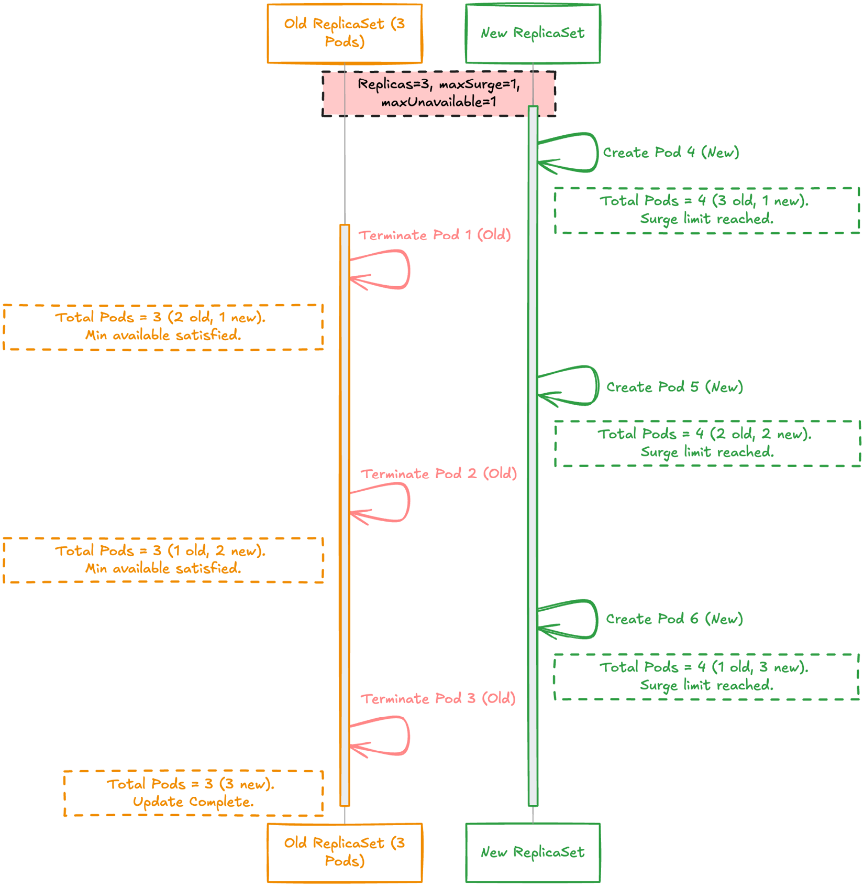
<details><summary>29. why would you use a statefulset instead of a deployment in kubernetes ?</summary>statefulsets are designed for workloads that require stable identities, persistent storage, and ordered startup/shutdown such as databases or stateful applications. The primary feature that distinguishes statefulsets from Deployments is orderly, graceful deployment and scaling. Statefulsets assign a unique ordinal number to each pod, which helps maintain a stable identity, consistent network, and stable storage, These ordinal indexes are used to name pods, such as `mysql-0`, `mysql-1` and so forth.</details>
<details><summary>30. what are statefulsets ? </summary>Statefulsets are kubernetes objects designed to manage stateful applications. They provide gurantees about the ordering and uniqueness of these pods. Unlike Deployments, which are suited for stateless applications and where Pods are often interchangeable, statefulsets maintain a sticky identity for each of their pods. These pods are created from the same spec, but they are not fungible--each has a persistent identifier that it maintains across any rescheduling </details>
<details><summary>31. What happened to the storage of Pod managed by a statefulset after it is deleted ?</summary>The associated persistent volume is retained and not deleted, allowing the pod to reattach to it if recreated </details>
<details><summary>32. why are Daemonsets useful in kubernetes clusters? </summary>Daemonsets ensure that specific pods, such as logging or monitoring agents, are automatically deployed to every node in the cluster. Daemonsets are integral part of kubernetes, enabling the efficient deployment of node-level services essential for the operation and management of your cluster. whether it's for logging, monitoring or any form of node-specific operation. Daemonsets provide a reliable and automated way to ensure these critical services are always running and up to date across all nodes in your cluster.</details>
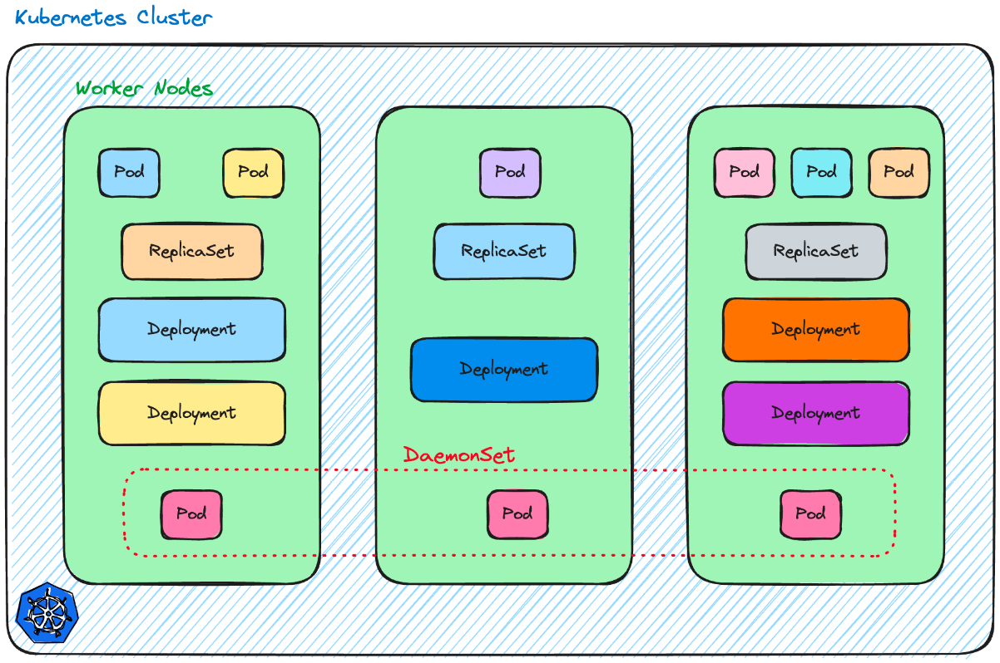
<details><summary>33. How do cronjobs differ from regular kubernetes jobs ?</summary>Jobs run once and complete, while cronjobs run jobs on a scheduled basis using a cron expression </details>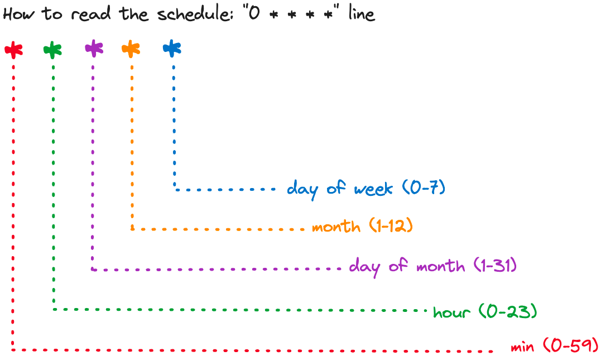
<details><summary>34. what is the purpose of the `ttlsecondafterfinished` field in kubernetes jobs?</summary>It sets to a TTL after the job completes, automatically cleaning up completed jobs and pods to reduce resource cluster </details>


## 5. principles of scaling: Horizontal vs Vertical

<details><summary>35. why is understanding scaling important in kubernetes ?</summary>Kubernetes runs dynamic workloads, knowing how to scale applications ensures you can keep them responsive, cost-efficient, and reliable under changing demand  </details>

<details><summary>36. what is the difference between scaling out and scaling in kubernetes ?</summary>Scaling out means adding mroe pods or nodes to handle higher loads, whereas scaling in removes them during low demand to save resources. Kubernetes automates both to match current workload needs efficiently </details>
<details><summary>37. what is vertical scaling in kubernetes,and how is it different from horizontal scaling ?</summary>Vertical scaling increases or decreases the resources (such as CPU or memory) assigned to existing pods, while horizontal scaling adds or removes pod replicas. Kubernetes can manage both, but vertical scaling is limited by the node's capacity </details>

<details><summary>38. Which kubernetes components are involved in the scaling process ?</summary>The API server receives the scaling request and stores it in etcd, and the controller manager acts on it by adjusting replicas. The scheduler assigns new pods to nodes, and the kubelet ensures those pods are created on the selected nodes.</details>
<details><summary>39. How does the HPA work in kubernetes ?</summary>The HPA watches metrics such as CPU or memory usage and automatically increases or decreases the number of pod replicas to match the current demand</details>

<details><summary>40. Is it possible to scale pods horizontally based on the size of some queues (such as RabbitMQ)? </summary>yes, there are 2 ways to do it. 1. Using custom metrics 2. using CNCF application called KEDA </details>
<details><summary>41. How does the VPA help to optimize resources in kubernetes?</summary>VPA Automatically adjusts CPU and Memory requests and limits for pods based on their actual usage, helping avoid both over-provisioning and underutilization </details>

<details><summary>42. What are the some of the best practices for VPA and HPA ?</summary>1. Configure Probes(liveness, rediness) and control resource requests and limits (HPA and VPA): HPA relies on these probes to make accurate scaling decisions.Have explicit resource requests and limits set for your containers. This helps HPA make informed scaling decesions based on accurate resources. For the VPA, it gives you more understanding of everything the VPA can do with your workloads.<br> 2. Define meaningful metrics and realistic scaling threasholds (HPA) <br> 3. Gradual implementation and testing in non-production environments (HPA and VPA) <br>4. Monitor and tweak (HPA and VPA) <br>4. Adopt HPA and VPA in the same cluster for different workloads </details>

## 6. Autoscaling in Action
<details><summary>43. what is cluster autoscaler ?</summary>Cluster Autoscaler (CA) is a tool that automatically resizes your cluster to match workload demand. The CA's job is to make sure every pod has a place to run, which cuts waste and optimizes costs.</details>
<details><summary>44. My cluster's CPU usage is at 95%, but the cluster autoscaler hasn't added any new nodes, is this expected behaviour ?</summary>yes, this is entirely expected behaviour. The cluster Autoscaler's trigger is not high resource utilization such as CPU or memory. it only acts when the kubernetes scheduler cannot place a pod due to insuffcient resources, resulting in a `pending` pod. As long as all existing pods are running - no matter how high their resources usage-the cluster autoscaler will remain idle. A scale-up will only occur when a new pod arrives that cannot be scheduled. </details>

<details><summary>45. walk me through how you'd enable node autoscaling in EKS ?</summary>As a foundation and guardtrails : Define our EKS cluster configuration, including the essential tags the CA needs for auto-discovery and the minimum/maximum size to prevent unexpected costs or outages., Establishing trust (IRSA): Enable the OIDC provider for our cluster in AWS IAM, creating the foundation for secure communication between our cluster and the AWS APIs, Principle of least privileges: craft a fine-grained IAM policy that grants the CA only the permissions it needs, strictly scoped to the resources it's supposed to manage. Creating the Identity: Generate the specififc IAM role and Kubernetes ServiceAccount, linking them together through the power of IRSA Deployment: Install the CA using its official HELM chart, configuring it to use our IRSA setup and setting safe, production-sensible arguments </details>
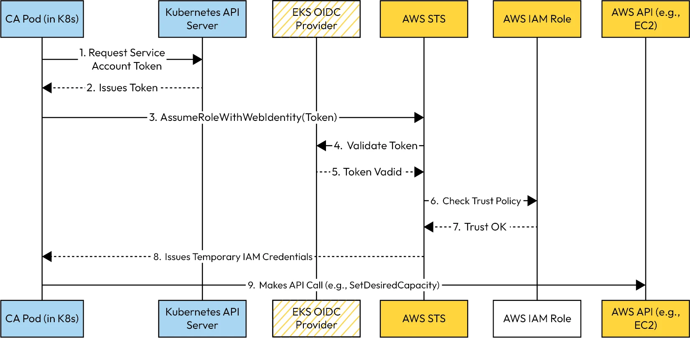
<details><summary>46. How does the cluster autoscaler discover which AWS Auto scaling groups it is allowed to manage ?</summary>The cluster autoscaler discovers manageable auto scaling groups(ASGs) using a specific set of AWS tags. These tags must be applied directly to the ASG, not just the instances, and their presence is non-negotiable for discovery. There are two mandatory tags: `k8s.io/cluster-autoscaler/enabled` must be set to "true" This signals "This autoscaling group is available for management" and `k8s.io/cluster-autoscaler/<cluster-name>` must be set to "owned" to associate the group with a specific cluster, preventing a single cluster autoscaler from trying to manage nodes belonging to another cluster.
```yaml
apiVersion: eksctl.io/v1alpha5
kind: ClusterConfig
metadata:
name: ${CLUSTER_NAME}
region: ${AWS_REGION}
version: "${EKS_LATEST_VERSION}"
managedNodeGroups:
- name: managed-ng-1
minSize: 1
desiredCapacity: 1
maxSize: 5
instanceType: t3.medium
volumeSize: 20
labels: { role: worker }
# Required tags for Cluster Autoscaler autodiscovery
tags:
k8s.io/cluster-autoscaler/enabled: "true"
k8s.io/cluster-autoscaler/${CLUSTER_NAME}: "owned"
```
</details>
<details><summary>47. You've deployed the cluster autoscaler, but your nodes aren't scaling up when pods are pending. You suspect it's a discovery issue. How would you troubleshoot this?</summary>My first step would be to verify the AWS tags on the ASG for my managed node group. I'd go to the EC2 console, find the ASG, and check its tags tab. I would confirm that the two required tags, `k8s.io/cluster-autoscaler/enabled` and `k8s.io/cluster-autoscaler/my-cluster-name`, are present and correctly spelled. If they're missing, the CA won't see the ASG and will never attempt to scale it. I would also check the CA pod logs for messages indicating it can't find any node groups to manage. </details>
<details><summary>48. To modify ASGs, the CA Pod needs AWS credentials, what is the most recommended method for granting these permissions ? </summary>The Short answer is IRSA, IRSA links a kubernetes service account to an AWS IAM role. This allows any pod using that service account to inherit the role's permissions without needing static secret keys. </details>
<details><summary>49. You're installing the cluster Autoscaler Helm chart on a cluster with IRSA already configured. Which two `rbac.serviceAccount` values are the most important to set, and why ?</summary>The two most critical values are `--set rbac.serviceAccount.create=false" and `--set rbac.serviceAccount.name=cluster-autoscaler`This is because i already created a Service account and linked to a specific IAM role via IRSA. I need to instruct Helm to use my existing, pre-configured ServiceAccount. If i let HELM create a new one, it won't have the necessary `eks.amazonaws.com/role-arn` annotation and the pod will fail with AccessDenied errors because it won't have any permissions to interact with AWS ASGs. </details>
<details><summary>50. Imagine a situation you deployed CA, but it is not scaling. what are the first three things you check?  </summary>1. Scale-up isn't happening despite pending pods. This is often an issue with discovery. The CA simply can't find the ASG it's supposed to manage. 
```
The link between CA and ASG is a set of specific tags. You need to confirm they are correctly applied to ASG itself, not just the instances.

1. Navigate to the EC2 console in AWS
2. Under Autoscaling, select Auto Scaling Groups
3. Find the ASG corresponding to your EKS node group
4. Select it and go to the tags tab
5. Confirm these two tags exist and are spelled correctly.
`
k8s.io/cluster-autoscaler/enabled with a value of true.
k8s.io/cluster-autoscaler/interview-charan-ca-cluster (or your cluster’s name) with a value of owned.
`
If these tags are missing or incorrect, the CA will ignore the node group completely.

2. The CA pod is crash-looping or its logs show AccessDenied Errors.

This is almost always an IRSA permission problem. The pod is trying to call AWS APIs (such as DescribeAutoScalingGroups) but being told it doesn't have the authority
```verification: The magic link in the IRSA chain is the annotation on the kubernetes `serviceaccount` this annotation tells the EKS control plane to swap the Pod's default token for temporary IAM credentials.

--> Run this command to inspect the service account:
`kubectl -n kube-system get sa cluster-autoscaler -o yaml`
--> you must see an annotation that looks like this: `eks.amazonaws.com/role-arn: arn:aws:iam::...` if that annotation is missing, it means you either forgot to create IRSA mapping or, more likely, you let the HELM chart create a new un-annotated ServiceAccount instead of using the one you prepared

3. scale-up works but scale-down never happens
--> This is the more subtle issue, as the autoscaler might be intentionally blocked from removing a node.

```
Verification: CA won't remove a node if it can't safely evict all the pods. Check for these common blockers:

    --> minSize constraint: First, check the obvious: is minSize of your ASG set to a value that prevents further scale-down?
    --> PodDisruptionBudget (PDBs): A PDB can prevent the autoscaler from evicting a pod if it would violate the budget (Ex: always keep at least 3 replicas of this app running") this is a legitimate safely feature, but it can pin a node.
    --> "unsafe to evict " pods: The autoscaler respects certain pods that it considers unsafe to evict. This includes pods with local storage (emptyDir doesn't count) or any pod with the annotation `cluster-autoscaler.kubernetes.io/safe-to-evict: "false"`.you can check for this by describing the pods on the underutilized node.
```
Tip: Avoid Autoscaler turf wars

Here's a critical operational Rule: Never run two different node autoscalers(ex: Cluster Autoscaler and karpenter) managing the same set of nodes. They will fight for control over the same resources. leading to unpredictable and chaotic scaling behaviour where one system adds a node and the other immediately tries to remove it.
``</details>

<details><summary> 51. is there any CA limitations ?</summary>yes, we do have some limitation w.r.to CA, Limited on-premise support, Scaling delays, performance at scale, Disruption tolerance assumption, resource-based, not utilization-based scaling,challenges with node constraints  </details>
<details><summary>52. How does karpenter's method of provisioning nodes fundamentally differ from the Cluster Autoscaler's cand what key advantage does this provide ? </summary>The cluster Autoscaler (CA) works directly by managing pre-defined ASGs. It tells the ASG to scale up or down and the ASG handles the interaction with EC2. In contrast, Karpenter works directly with EC2 fleet API without needing ASGs. This direct approach is a major advantage because it allows karpenter to provision the most optimal and cost-effective instance type based on the exact needs of pending pods, rather than being limited to the instance types defined in a node group </details>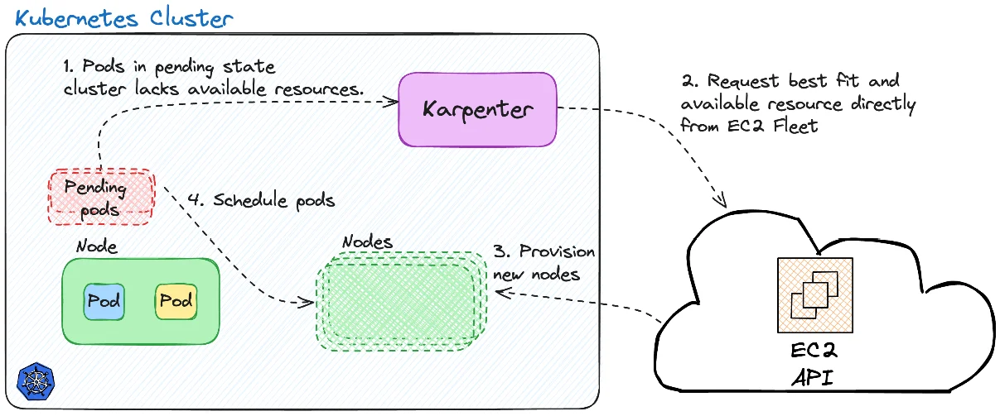
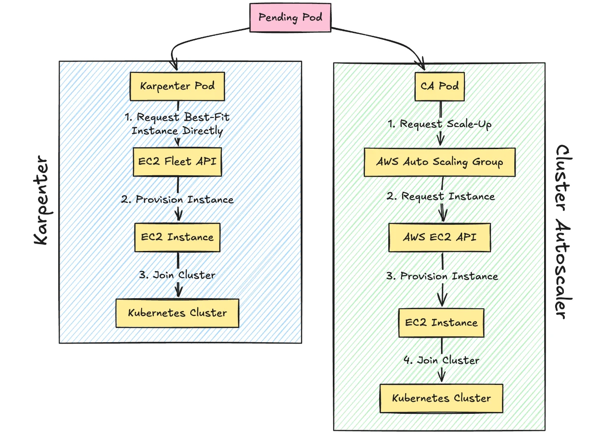
<details><summary>53. What is a NodePool in karpenter, and what are two key constraints you can define within it to control which nodes get provisioned ?</summary>
A nodepool is a karpenter resource that defines how it should manage unschedulable pods and provision nodes. It sets the rules and characteristics for the nodes karpenter creates. Two key constraints you can define are as follows:
    - Instance types: You can specify a list of allowed instance types or families (e.g.. only t3 or m5 instances)
    - Zones: you can restrict node provisioning to specific availability zones, which is critical for applications that rely on persistent volumes or have other zone-specific dependencies
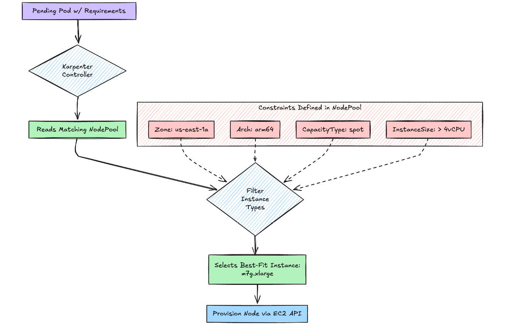 </details>
<details><summary>54. How would you use a karpenter Nodepool to ensure that only specific, high-priority pods can run on newly provisioned nodes?</summary>I would use taints within the 'NodePool' configuration. By applying a specific taint to the 'Nodepool'- for example, 'priority-workload-only=true:NoSchedule"-any node that karpenter creates from that pool will be marked with this taint. This prevents normal pods from being scheduled on it. To complete the setup, I would ensure my high-priority application's pods have the corresponding toleration, which would allow them to be scheduled on these reserved, newly created nodes. This is an effective strategy to dedicate capacity for specific workloads. In scenarios where a pod qualifies for multiple NodePools, karpenter selects the NodePool with the highest assigned weight for provisioning. </details>
<details><summary>55. Within the nodepool, how would you fine-tune the behavior of the kubelet ?</summary>A common scenario for kubelet customization is managing the maximum number of pods per node. Here's how you can manage this: 

- Dynamic Kubelet configuration: you can adjust kubelet settings dynamically based on your cluster's characteristics. For instance, if you're operating within a cloud environment where there are IP address limitations per node, you can configure kubelet to limit the number of pods relative to the amount of available CPU resources to prevent node saturation.

- Static Pod limit: Alternatively, you can set a static upper limit on the number of pods per node. This method is straightforward and ensures you don't exceed the count, avoiding issues such as IP address shortages, which can prevent Pod deployment </details>
<details><summary>56. What are disruption settings in karpenter? </summary>Disruption settings in karpenter are designed to manage and minimize the impact of workloads during node consolidation and scaling. These settings ensure that critical applications stay available and stable while karpenter optimizes resource usage. </details>
<details><summary>56. Explain karpenter's consolidation feature. What is its main purpose and what are the two modes it can operate in ?</summary>Consolidation is a feature in karpenter that actively works to reduce cluster costs by optimizing resource utilization. Its main purpose is to identify underutilized nodes and replace them with cheaper alternatives or terminate them if the workloads can fit elsewhere. The two primary operating modes are as follows:
    - WhenUnderutilized: This mode flags nodes for potential consolidation when they are running at low capacity.

    - whenEmpty: This mode targets nodes that are not hosting any workload pods, making consolidation decisions much simpler

Below are few strategies for node consolidation:

- Deletion and replacement: Nodes may be marked for deletion if Karpenter determines their workloads can be accomdated by the spare capacity on other nodes. Alternatively, nodes might be replaced with more cost-efficient ones if the combined capacity of other nodes and a new, less expensive node can support the existing workloads.

- Heuristics for multi-node consolidation: Given the complexity of multi-node consolidation, karpenter employs heuristic methods [algorithms used in cloud computing and data centers to optimize resource utilization and reduce costs by migrating workloads from multiple underutilized physical machines (nodes) onto fewer, more efficiently packed machines] to identify likely candidates for consolidation rather than attempting to evaluate all possible combinations. 

- Consolidation preferences: when considering multiple nodes for consolidation, karpenter aims to minimize workload disruption by prioritizing the removal of nodes that have fewer Pods, are nearing the end of their lifespan, or are running lower-priority workloads.

- By implementing these strategies, Karpenter ensures that node consolidation is performed efficiently and with minimal disruption to your workloads
         </details>
<details><summary>57. How karpenter handles budgets ? </summary>Here's breakdown of how karpenter handles budgets:

- Budget calculations: If Nodepool's disruption budget is based on percentage, karpenter rounds up the product of the total node count and the percentage to get the number of nodes that can be disrupted . It then subtracts the number of nodes already being deleted and those marked as 'NotReady'.

- Non-Percentage Budgets: When a budget is fixed number instead of a percentage, the calculation is straightforward: karpenter subtracts the number from the total node count, accounting for nodes that are being deleted and those in a NotReady state.

- Minimum values for multiple budgets: For NodePools with several budgets, karpenter applies the most restrictive (or the minimum) value among them. </details>
<details><summary>58. How can you use karpenter to ensure nodes are regularly recycled, and why is this a good practice ? </summary>You can use the 'expireAfter' setting within a NodePool's disruption configuration. By setting a duration, such as '720h' for 30 days, you instruct karpenter to automatically drain and terminate nodes after they reach that age. This is valuable best practice for maintaining cluster health and security. Regularly recycling nodes helps to apply the latest security patches from a new AMI, reduces configuration drift, and prevents potential issues that can arise on long-running nodes. </details>

## 7. Networking, Services and Security

<details><summary>59. What are all the different components of the kubernetes networking ? </summary> 
1. Pod Communication <br> 2. Services and ingress <br> 3. Network policies <br> 4. kube-proxy <br> 5. Domain name system (DNS) <br> 6. CNI Plugins</details>
<details><summary>60. How do pods communicate in kubernetes ?</summary>The pods communication can be split into multiple types of scenarios...." 1. How Do containers within one pod communicate ?<br> 2. How do pods on the same node communicate ? <br>3. How do pods on different nodes communicate ?</details>
<details><summary>61. How do the containers within one pod communicate ? </summary>Containers within the same pod in kubernetes can communicate with each other using local host network interface. When multiple containers are part of a single pod, they share the same network namespace. This means they can reach each other using loopback address (127.0.0.0) and communicate over the localhost network. Essentially, it's as if all the containers within a pod are running on the same host, enabling them to interact seamlessly without external networking. This local communication within the pod is fast and efficient and doesn't involve the complexities of external network routing </details>
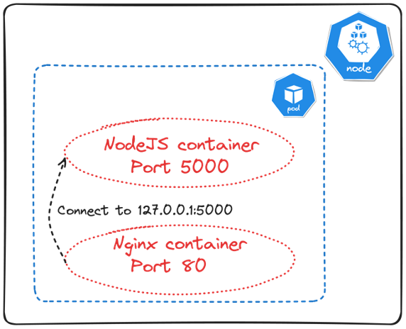
<details><summary>62. How do pods on the same node communicate ?</summary> Pods on the same node in kubernetes can communicate with each other directly over the host machine's network. Each pod on a node is assigned a unique IP address within the node's network space. Containers within these pods can use this Ip address to communicate. when containers in one pod want to communicate with containers in another pod on the same node, they can use the destination pod's IP address directly. This communication occurs without external routng since the pods are co-located on the same machine. </details>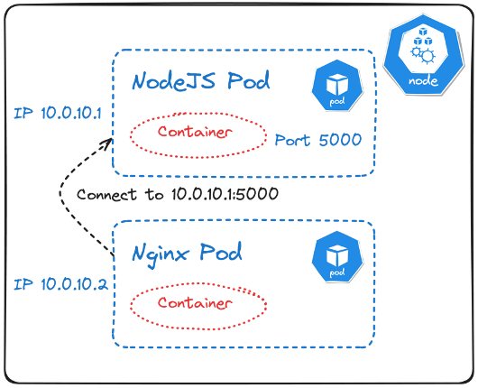
<details><summary>63. How do pods on different nodes communicate ? </summary> Pods on different nodes in kubernetes communicate with each other over the cluster network. When pods are spread across multiple nodes, inter-node communication becomes essential. Kubernetes facilitates this communication through various networking components. </details>

<details><summary> </summary> </details>
<details><summary> </summary> </details>
<details><summary> </summary> </details>

## 8. Essentials of kubernetes networking

<details><summary> </summary> </details>
<details><summary> </summary> </details>
<details><summary> </summary> </details>
<details><summary> </summary> </details>
<details><summary> </summary> </details>
<details><summary> </summary> </details>

## 9. Kubernetes Network Architecture: Services and ingresses

<details><summary> </summary> </details>
<details><summary> </summary> </details>
<details><summary> </summary> </details>
<details><summary> </summary> </details>
<details><summary> </summary> </details>
<details><summary> </summary> </details>

## 10. Storage: Persitence and CSI Drivers

<details><summary> </summary> </details>
<details><summary> </summary> </details>
<details><summary> </summary> </details>
<details><summary> </summary> </details>
<details><summary> </summary> </details>
<details><summary> </summary> </details>

## 11. Security best practices in Kubernetes and RBAC

<details><summary> </summary> </details>
<details><summary> </summary> </details>
<details><summary> </summary> </details>
<details><summary> </summary> </details>
<details><summary> </summary> </details>
<details><summary> </summary> </details>

## 12. Deployment, Application management, Gitops

<details><summary> </summary> </details>
<details><summary> </summary> </details>
<details><summary> </summary> </details>
<details><summary> </summary> </details>
<details><summary> </summary> </details>
<details><summary> </summary> </details>

## 13. Real-world deploymnet scenarios and Continous Deployment

<details><summary> </summary> </details>
<details><summary> </summary> </details>
<details><summary> </summary> </details>
<details><summary> </summary> </details>
<details><summary> </summary> </details>
<details><summary> </summary> </details>

## 14. Understanding Gitops: Principles and practices

<details><summary> </summary> </details>
<details><summary> </summary> </details>
<details><summary> </summary> </details>
<details><summary> </summary> </details>
<details><summary> </summary> </details>
<details><summary> </summary> </details>

## 15. Reliability, Monitoring, and Maintainance

<details><summary> </summary> </details>
<details><summary> </summary> </details>
<details><summary> </summary> </details>
<details><summary> </summary> </details>
<details><summary> </summary> </details>
<details><summary> </summary> </details>

## 16. Custom Resource Definitions and Operators

<details><summary> </summary> </details>
<details><summary> </summary> </details>
<details><summary> </summary> </details>
<details><summary> </summary> </details>
<details><summary> </summary> </details>
<details><summary> </summary> </details>

## 17. Ensuring High Availability and Reliability

<details><summary> </summary> </details>
<details><summary> </summary> </details>
<details><summary> </summary> </details>
<details><summary> </summary> </details>
<details><summary> </summary> </details>
<details><summary> </summary> </details>

## 18. Monitoring Best practices

<details><summary> </summary> </details>
<details><summary> </summary> </details>
<details><summary> </summary> </details>
<details><summary> </summary> </details>
<details><summary> </summary> </details>
<details><summary> </summary> </details>

## 19. Backup, maintainance, and Disaster Recovery in kubernetes

<details><summary> </summary> </details>
<details><summary> </summary> </details>
<details><summary> </summary> </details>
<details><summary> </summary> </details>
<details><summary> </summary> </details>
<details><summary> </summary> </details>

## 20. Troubleshooting and Best practices

<details><summary> </summary> </details>
<details><summary> </summary> </details>
<details><summary> </summary> </details>
<details><summary> </summary> </details>
<details><summary> </summary> </details>
<details><summary> </summary> </details>

## 21. Real-world troubleshooting Scenarios

<details><summary> </summary> </details>
<details><summary> </summary> </details>
<details><summary> </summary> </details>
<details><summary> </summary> </details>
<details><summary> </summary> </details>
<details><summary> </summary> </details>

## 22. Common mistakes and how to avoid them 

<details><summary> </summary> </details>
<details><summary> </summary> </details>
<details><summary> </summary> </details>
<details><summary> </summary> </details>
<details><summary> </summary> </details>
<details><summary> </summary> </details>

## 23. Interview stories from authors

<details><summary> </summary> </details>
<details><summary> </summary> </details>
<details><summary> </summary> </details>
<details><summary> </summary> </details>
<details><summary> </summary> </details>
<details><summary> </summary> </details>

